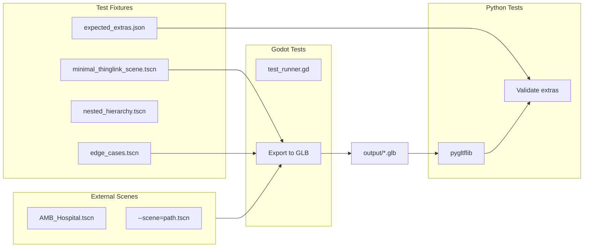

# Testing Architecture

This document describes the test infrastructure for xbase_plugin developers.

## Overview

The test framework uses a combination of:
- **Godot tests** (GDScript) - Test export functions, scene processing
- **Python tests** (pytest + pygltflib) - Validate exported GLTF files
- **Test fixtures** - Self-contained .tscn files with known values



## Running Tests

### All Tests (Recommended)

```bash
cd godot_proj/addons/xbase_plugin
pytest
```

This runs:
1. Python unit tests (data loading, components)
2. Godot tests via subprocess
3. GLTF validation tests

### Python-Only Tests

```bash
pytest -m "not godot"
```

### Godot Tests Only

```bash
pytest -m godot
```

Or directly:

```bash
godot --headless --editor --script res://addons/xbase_plugin/tests/test_runner.gd -- --all
```

### GLTF Validation Tests

```bash
pytest -m gltf_validation
```

## Validating Custom Scenes

### Via Godot CLI

```bash
# Export and validate a specific scene
godot --headless --editor --script tests/test_runner.gd -- --scene=res://amb/AMB_Hospital.tscn

# Export only (for Python to validate later)
godot --headless --editor --script tests/test_runner.gd -- --export-only
```

### Via Python

```bash
# Validate a specific exported GLB
pytest share/tests/test_gltf_validation.py --glb=tests/output/my_scene.glb

# With custom expected values
pytest share/tests/test_gltf_validation.py --glb=path.glb --expected=expected.json
```

## Test Fixtures

Located in `tests/fixtures/`:

| File | Purpose |
|------|---------|
| `minimal_thinglink_scene.tscn` | Basic ThingLink with hierarchy |
| `edge_cases.tscn` | Empty strings, special characters, unicode |
| `nested_hierarchy.tscn` | Deep nesting (5+ levels), siblings |
| `all_components.tscn` | All components: Layer, Edge, PivotOverride |
| `expected_extras.json` | Expected GLTF extras for each fixture |

## Adding New Test Fixtures

1. Create a new `.tscn` file in `tests/fixtures/`
2. Add ThingLinkNode3d components with known values
3. Add expected values to `expected_extras.json`
4. Add test case to `test_gltf_validation.py`

### expected_extras.json Format

```json
{
  "fixture_name": {
    "NodeName": {
      "components": [
        {
          "type": "ThingLink",
          "ThingInstanceLabel": "expected-label",
          "PhysicalType": 7,
          "PhysicalTypeString": "Room"
        },
        {
          "type": "Layer",
          "Layers": "Default,Walls"
        }
      ]
    }
  }
}
```

## GLTF Extras Format

The exporter writes components to GLTF node extras as numbered entries:

```json
{
  "extras": {
    "1": {
      "type": "Axomem.XScape.Core.ThingLink,XScape.Core",
      "ThingInstanceLabel": "room-101",
      "PhysicalType": 7,
      "PhysicalTypeString": "Room"
    },
    "2": {
      "type": "Axomem.XScape.Core.Layer,XScape.Core",
      "Layers": "Default,Walls",
      "Validation": "OK"
    }
  }
}
```

## Directory Structure

```
tests/
├── fixtures/                    # Test scene files
│   ├── minimal_thinglink_scene.tscn
│   ├── edge_cases.tscn
│   ├── nested_hierarchy.tscn
│   ├── all_components.tscn
│   └── expected_extras.json
├── integration/                 # Godot integration tests
│   └── test_scene_export.gd
├── unit/                        # Godot unit tests
│   ├── test_gltf_export.gd
│   └── test_thinglink_node.gd
├── output/                      # Exported GLB files (git-ignored)
├── test_config.json
└── test_runner.gd

share/tests/                     # Python tests
├── conftest.py
├── test_data_loading.py
├── test_thinglink_injector.py
├── test_godot_integration.py
└── test_gltf_validation.py
```

